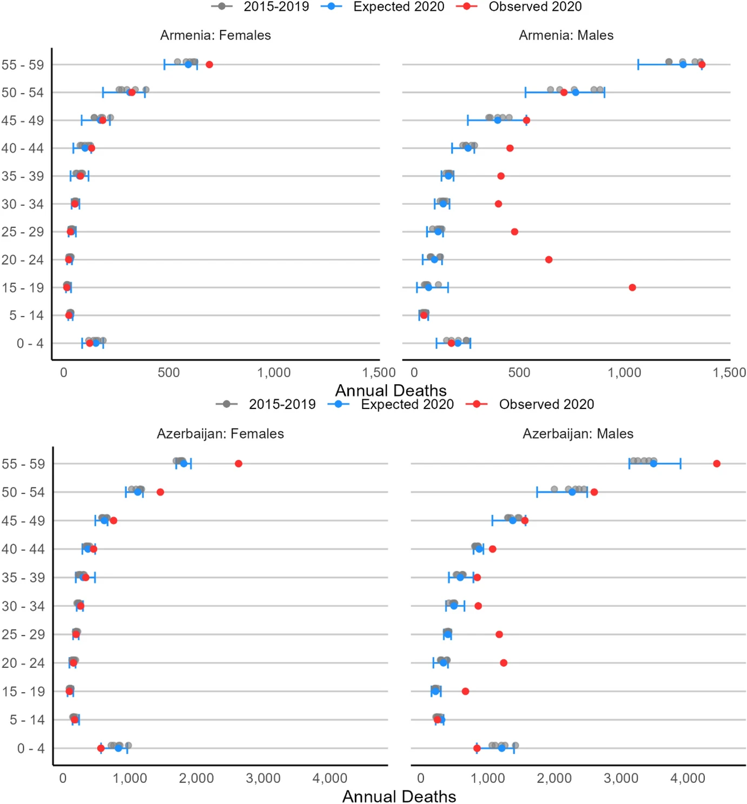

# The Casualties of War: An Excess Mortality Estimate of Lives Lost in the 2020 Nagorno-Karabakh Conflict
Data and Results for Karlinsky & Torrisi (2023): [The Casualties of War: An Excess Mortality Estimate of Lives Lost in the 2020 Nagorno-Karabakh Conflict](https://link.springer.com/article/10.1007/s11113-023-09790-2). _Population Research and Policy Review_

## Contents
`KT_NK_War_data.csv` contains all papers' data and estimates. See published record for details. The variables in the file are:

### Raw data

* `territory`: Name of the country or territory: Armenia, Azerbaijan, Artsakh, Georgia, Dagestan Republic (Russia), Iranian Azerbaijan.  
* `group`: War (belligerents) or Neighbors.
* `sex`: Female or Male.
* `age_group`: Age group.
* `age_low`: Lower bound of age group.
* `year`: 2015 to 2020.
* `deaths`: Total annual deaths for territory-sex-age_group.

### Estimates

* `mean_pred`, `trend_pred`, `lc_pred`: Point estimates for 2020 expected deaths from Overdisperessed Poisson Mean, OP Trend and Lee-Carter models.
* `ci_low`, `ci_high`: Confidence interval lower and upper bound for each estimate.
* `final_pred`: Final point estimate for 2020 expected deaths.
* `final_ci_low`, `final_ci_high`: Final Enveloping Interval for 2020 expected deaths.
* `excess`, `excess_low`, `excess_high`: Point estimate and Enveloping Interval for 2020 excess deaths.